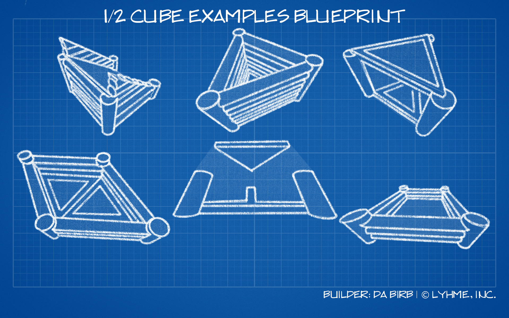
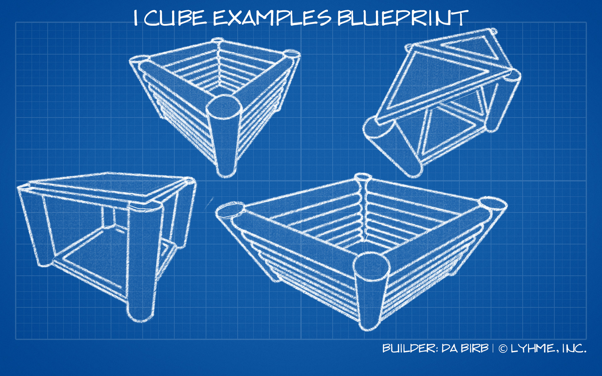
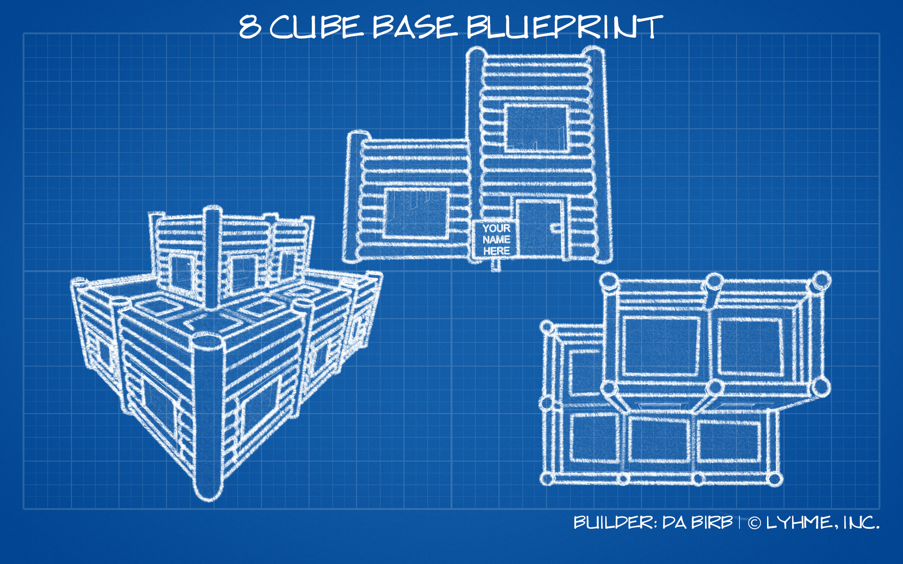
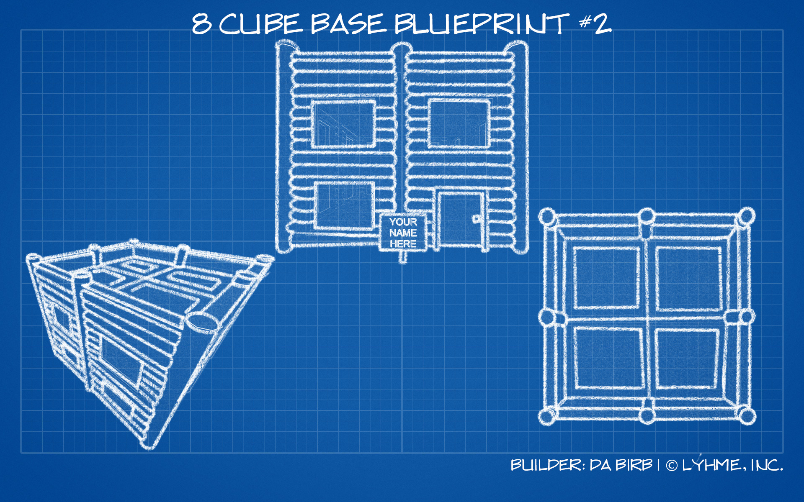
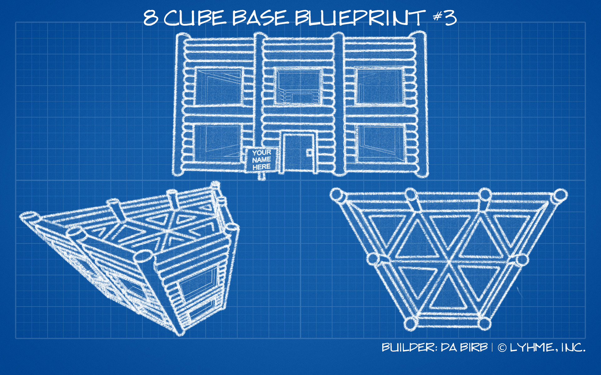
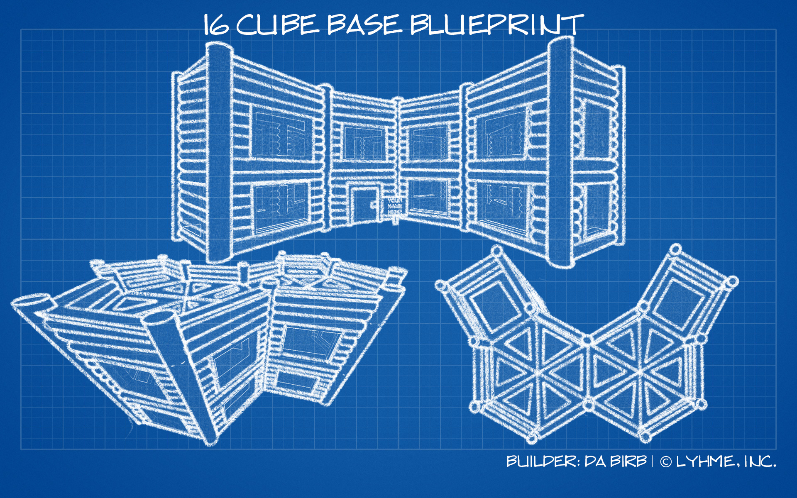
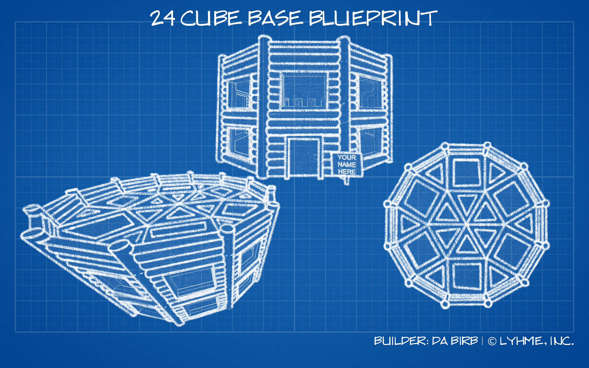
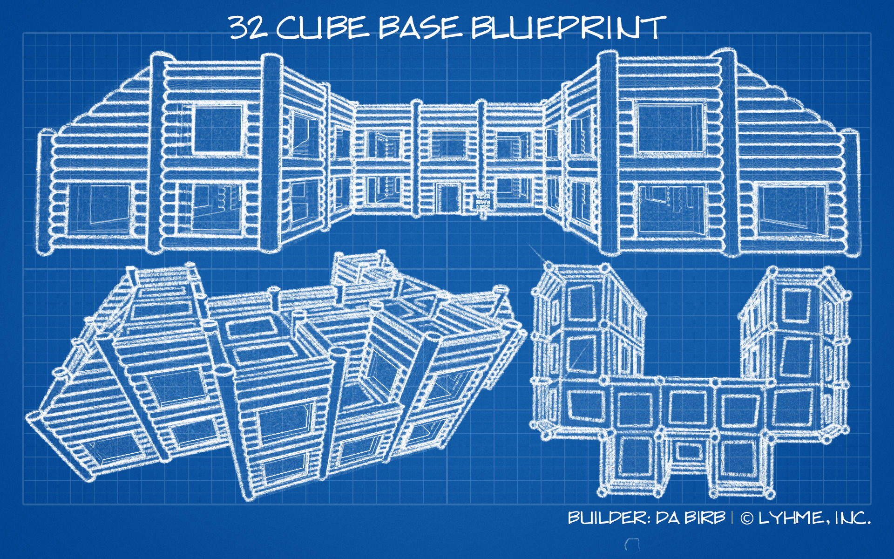

# Cubes

## All About Cubes

When it comes to building you may hear a lot of talk about "cubes" and ask _huh, what are those?_ Well, you are in luck! Below are a few images for visual examples of what we call cubes.

### ½ Cube Examples

### 1 Full Cube Examples

## Putting It All Together

Now that you know what a ½ cube is along with 1 full cube, here are a few examples of 8, 16, and even 32 cube bases.

### 8 Cube Base Examples

### 16 Cube Base Example

### 24 Cube Base Example

### 32 Cube Base Examples


We do have the right to use the background commercially. \
We did not make the grid ourselves or remove the original watermark. \
Credit to whoever did, however, we did make the blueprints themselves.

